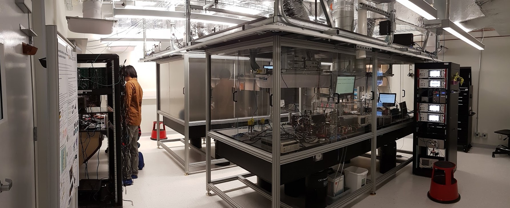

### One-paragraph overview
Placeholder: describe what algorithmic work you do (protocols, compilation, benchmarking, verification, learning-assisted design).

### Themes
#### Control and compilation
Placeholder text.

#### Learning-based methods
Placeholder text.

### Representative publications


